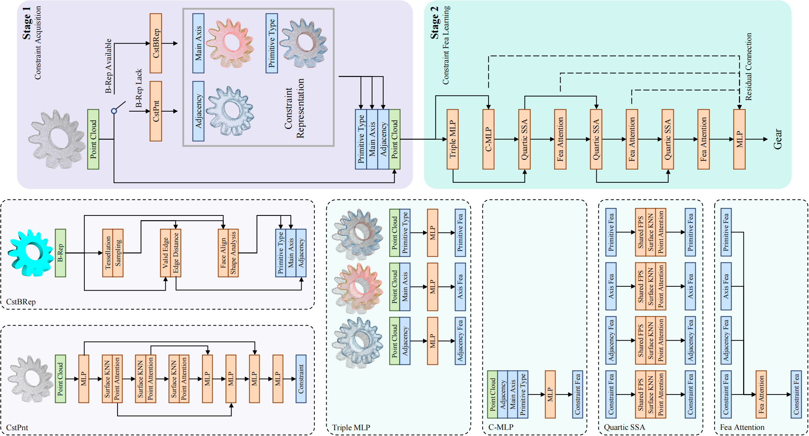

# Constraint Learning for Parametric Point Cloud

## Model scripts
### train classification
`train_cls.py`

### train segmentation
`train_seg.py`

### train constraint prediction
`train_cstpred.py`

### generate constraints from B-Rep data
`cst_brep.py`

## Structure
### overall

